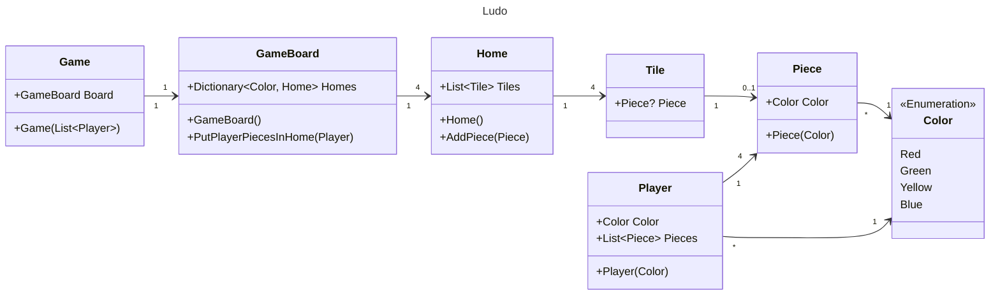

```mermaid
---
title: Ludo
---
classDiagram
    direction LR
    class Game{
        +GameBoard Board
        +Game(List&lt;Player>)
    }
    class GameBoard{
        +Dictionary&lt;Color, Home> Homes
        +GameBoard()
        +PutPlayerPiecesInHome(Player)
    }
    class Home{
        +List~Tile~ Tiles
        +Home()
        +AddPiece(Piece)
    }
    class Tile{
        +Piece? Piece
    }
    class Piece{
        +Color Color
        +Piece(Color)
    }
    class Player{
        +Color Color
        +List~Piece~ Pieces
        +Player(Color)
    }
    class Color{
        <<Enumeration>>
        Red
        Green
        Yellow
        Blue
    }
    
    Game "1" --> "1" GameBoard
    GameBoard "1" --> "4" Home
    Home "1" --> "4" Tile
    Tile "1" --> "0..1" Piece
    
    Player "*" --> "1" Color
    Player "1" --> "4" Piece
    Piece "*" --> "1" Color
```

