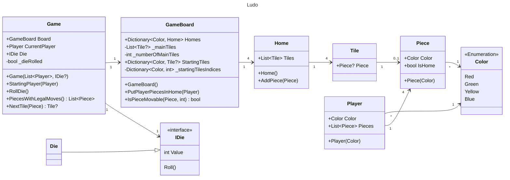

| Term                          | Meaning                                                                                                                                            |
|-------------------------------|----------------------------------------------------------------------------------------------------------------------------------------------------|
| Game board                    | he playing surface for Ludo, which is typically square in shape and divided into colored sections                                                  |
| Spaces or tiles               | The individual squares on the game board where players move their tokens                                                                           |
| Tokens or pawns               | The playing pieces used to represent each player's position on the game board. In Ludo, each player typically has four tokens of the same color    |
| Home or house                 | The area of the game board where each player's tokens start at the beginning of the game                                                           |
| Starting point or entry point | The first tile outside a player's house where their tokens enter the board                                                                         |
| Finish line                   | The last row of spaces on the game board that players must move their tokens to in order to win the game                                           |
| Dice                          | The small cubes used to determine the number of spaces a player can move their token on their turn                                                 |
| Barriers or blockades         | The obstacles that prevent a player's token from moving forward, which can be created by other players' tokens or certain spaces on the game board |
| Safe zones or home stretch    | The final row of spaces before a player's tokens reach the finish line, where their tokens are safe from being captured by other players' tokens   |
